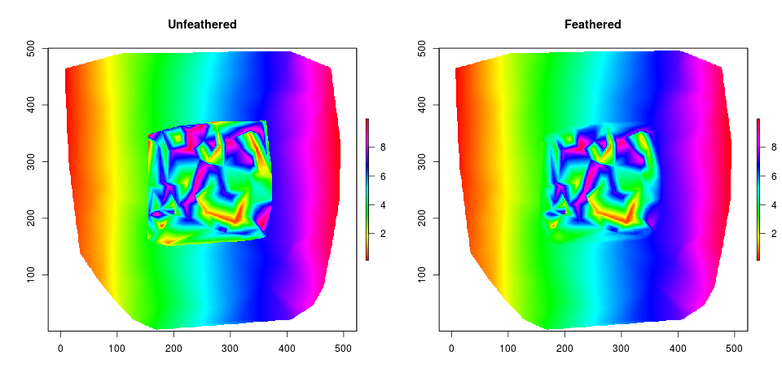
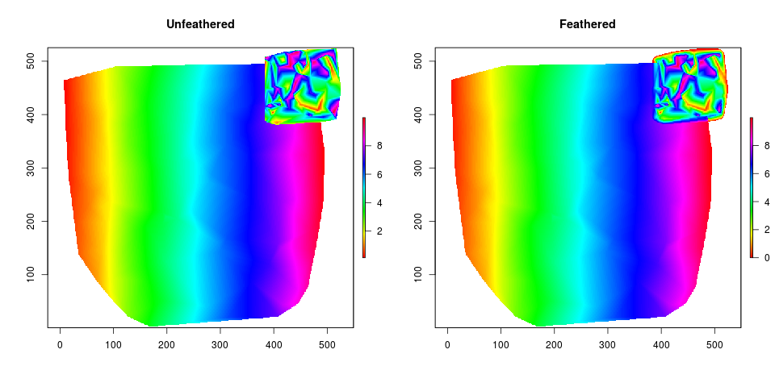

# featherRasters
Functions for feathering rasters in a raster merge.

These functions will merge two rasters together feathering the edges so that the first raster will blend into the second based on a `featherDist` value. 

This function works best when the first raster is completely inside the second. More work needs to be done to allow the first raster to be overlapping partially with the second. `featherRasters()` will work in this condition but the results are not ideal. 

View `test.r` to see usage for `featherRasters()`. It will produce the following graphics:

  
Here it can be seen that rasters that are overlapping, where one is not completely enclosed inside the other, have odd effects and the function needs work.

Also, this function is quite slow and would benefit from better memory management. If performance becomes an issue one will need to subset their data to only the merge area, then add back to their original raster, otherwise, this tool may be take too long to run to be useful.
